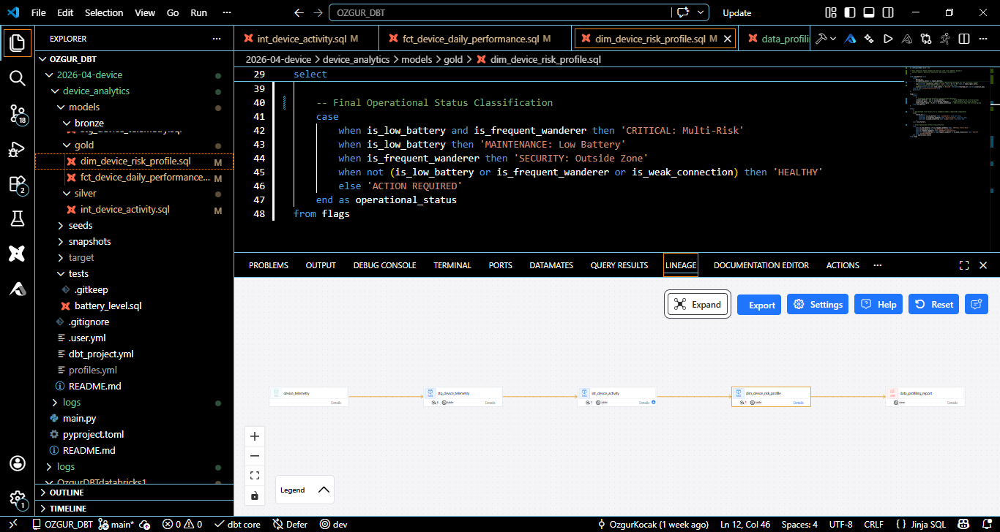
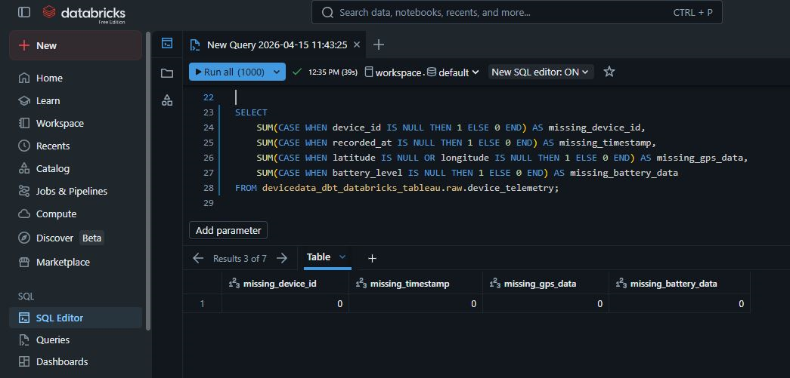
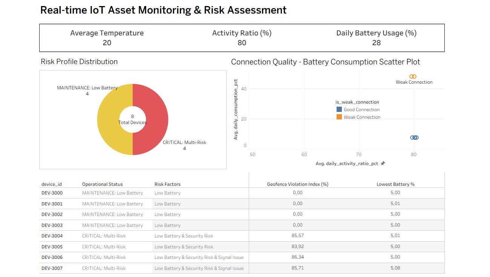

# IoT Asset Monitoring & Risk Assessment (dbt + Databricks + Tableau)

## Overview

This project demonstrates an end-to-end modern data stack workflow designed to monitor IoT device health and operational risks. The goal is to transform raw telemetries into a structured, analytics-ready model to identify hardware issues, specifically the impact of connectivity on battery performance.

-----

## Tech Stack

  * **dbt Core** (CLI-based transformation)
  * **Databricks** (Cloud Data Lakehouse & SQL Warehouse)
  * **Tableau Public** (Data visualization & Root Cause Analysis)
  * **Python/Jinja** (Dynamic SQL generation for profiling)
  * **Git** (Version control)

-----

## Data Source

The dataset consists of real-time IoT device telemetry including:

  * **Device Metadata:** Unique IDs (`device_id`) and operational status.
  * **Sensor Data:** Battery levels, ambient temperature, and movement intensity.
  * **Connectivity Metrics:** Signal strength indicators (Weak vs. Good connection).

-----

## Project Architecture

The project follows the **Medallion Architecture** to ensure data quality:

  * **Bronze:** Staging models for raw ingestion (`stg_device_telemetry`).
  * **Silver:** Intermediate models for activity ratios and performance metrics (`int_device_activity`).
  * **Gold:** Business-ready risk profiles (`dim_device_risk_profile`, `fct_device_daily_performance`).

-----

## Data Profiling & Exploratory Analysis

Comprehensive profiling was conducted in Databricks using dynamic Jinja macros to automate metric analysis.

  * **Statistical Summaries:** Automated calculation of Mean, StdDev, and Min/Max for IoT sensors.
  * **Null Analysis:** Validation of GPS and battery data integrity.

-----

## Data Modeling & Analysis

### Key Features

  * **Dynamic Metric Profiling:** Utilizing dbt `analyses` for scalable data quality checks.
  * **Root Cause Discovery:** Isolated "Weak Connection" as the primary driver for abnormal battery drainage.
  * **Modular SQL:** Use of `ref()` and `source()` for environment-agnostic modeling.

-----

## Data Visualization (Tableau)

The Tableau dashboard provides deep-dives into fleet health and risk factors.

  * **Risk Profile Distribution:** Categorizing devices into "Maintenance" or "Critical" based on risk factors.
  * **Battery Consumption Trends:** Time-series analysis of usage vs. recharge gains.
  * **Scatter Plot Analysis:** Correlation between Activity Ratio and Battery Consumption.

-----

## Key Insights

  * **The "Signal-Battery" Paradox:** Devices with a "Weak Connection" consume significantly more battery than those with a "Good Connection" at identical activity levels.
  * **Risk Clustering:** Geofence violations are highly correlated with devices flagged for "Multi-Risk" status.

-----

## Project Structure

```text
device_analytics/
├── analyses/       # Dynamic SQL profiling (1, 2, 3)
├── models/
│   ├── bronze/     # Staging & Sources
│   ├── silver/     # Intermediate Logic
│   └── gold/       # Final Risk Dimensions & Facts
├── images/         # Documentation assets
├── macros/         # Custom utility macros
└── snapshots/      # Historical status tracking
```

-----

## How to Run

1.  Clone the repository.
2.  Configure `profiles.yml` for Databricks.
3.  Install dependencies: `dbt deps`.
4.  Run:

<!-- end list -->

```bash
dbt run
dbt test
dbt docs generate
```

-----

## dbt Model Structure & Lineage


## Data Profiling (Databricks)


## Tableau Dashboard



-----

## Notes

  * **Open Source Focus:** dbt Core and Databricks Community Edition were used intentionally to keep the project fully open-source and accessible.
  * **Zero Cost:** No paid tools or managed services were required to build this end-to-end pipeline.
  * **Practicality:** The focus remains on a practical, real-world analytics engineering workflow, especially in managing IoT data at scale.